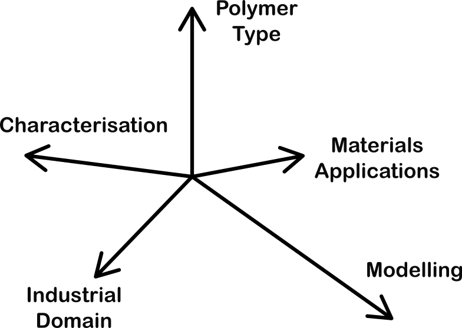

# Hyperdimensional Polymer Ontology

|  | An ontology to capture the staggering diversity of polymeric materials and their applications. |
| ---------------------------------------- | ------------------------------------------------------------ |

We apply semantic technologies to describe the following domains:

* Composite materials
* Energy materials
* Bio-materials.
